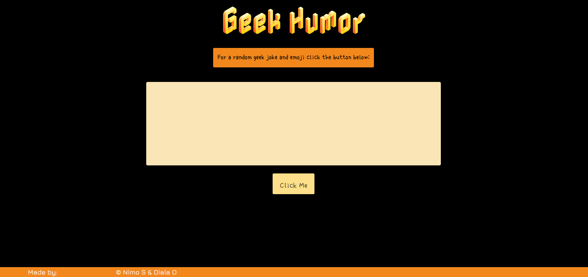

# Geek-Humor
PROJECT DESCRIPTION:

This project requires us to create a front-end application that will showcase our knowledge on the following requirements below:

REQUIREMENTS:
- Use a CSS framework other than Bootstrap
- Be deployed to Github Pages
- Be interactive (accept & respond to user input)
- Use at least 2 server-side APIs
- Include at least one modal, and does not use native browser alert, confirm, or prompt functionality
- Use client-side storage
- Be responsive
- Have a polished UI
- Have a clean repository that meets quality coding standards (file structure, naming conventions, follows best practices for class/ID-naming conventions, indentation, quality comments, etc.)
- Have a quality README (with unique name, description, technologies used, screenshot, and link to deployed application)

Important step:
- Each teammate must add this project to the portfolio application created in Module 2

USER STORY:
- AS A joke enthusiast
- I WANT TO entertain myself with a blend of geek humor and random emojis
- SO THAT I can brighten my day with a spontaneous laugh with one click of a button

LINKS:
Screenshot: 

- Link to github repository for this project: https://github.com/Nimo20/Geek-Humor 

- Link to deployed application: